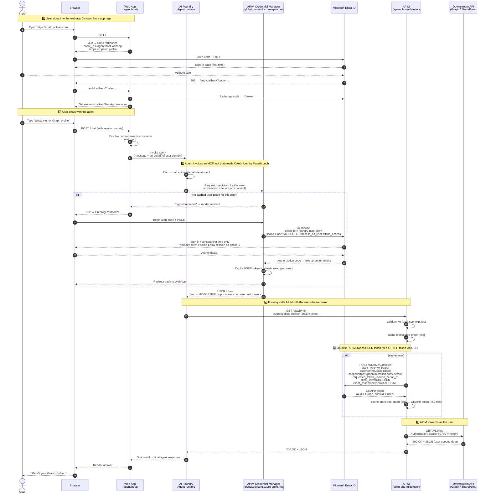

# Auth Patterns: AI Foundry → APIM → Downstream Resources

This repo documents auth patterns for an **AI Foundry** agent that calls
APIs and resources through **Azure API Management** (APIM). It covers two
distinct scenario families:

- **The agent acts as the signed-in user** against Microsoft 365
  (SharePoint, Graph). This uses the **On-Behalf-Of (OBO)** flow, with APIM
  as the OBO middle tier.
- **External users** (in other Entra tenants, or with no Entra at all) call
  the agent, but the agent only touches **your** tenant's resources. This
  uses **per-agent managed identities** plus a validated user identity for
  per-user separation. **No OBO involved.**

Pick a scenario from the table below; each doc is self-contained.

---

## Documents

| Family | Scenario | When to use | File |
|---|---|---|---|
| **OBO** (agent acts as user) | OBO to **SharePoint REST** | Agent reads SharePoint sites/lists/libraries on behalf of the signed-in user | [`obo-foundry-apim-sharepoint.md`](./obo-foundry-apim-sharepoint.md) |
| **OBO** (agent acts as user) | OBO to **Microsoft Graph** | Agent reads cross-M365 data (Files, Mail, Calendar, Teams, Users) on behalf of the user | [`obo-foundry-apim-graph.md`](./obo-foundry-apim-graph.md) |
| **Multi-tenant external** | Option A — **Multi-tenant Entra app reg** | Few external partners, all on Entra, you can reach their admin once for consent | [`obo-foundry-apim-multitenant.md`](./obo-foundry-apim-multitenant.md) |
| **Multi-tenant external** | Option B — **Entra External ID (CIAM)** | Many partners, partners not on Entra, or you need self-service signup | [`multitenant-external-id.md`](./multitenant-external-id.md) |

---

## Decision quick-reference

- Agent needs to read a SharePoint **site/list/library** as the user?
  → **OBO to SharePoint REST**
- Agent needs cross-M365 data (Files, Mail, Calendar, Teams, Users) as the user?
  → **OBO to Microsoft Graph**
- Agent needs both? → One APIM app, two APIM APIs, two policies (same shape)
- External users from other companies, only touching **your tenant's**
  resources, **few partners on Entra**? → **Multi-tenant Option A**
- External users, **many partners or non-Entra users**, want self-service
  signup? → **Multi-tenant Option B (External ID)**
- Mix of both? → APIM can accept either issuer; see Option B doc's
  side-by-side section.

---

## Two scenario families at a glance

The two families look similar (both are "user → Foundry agent → APIM →
something") but they answer different questions and use different auth
machinery. Reading the comparison below first will save confusion when you
dive into the individual docs.

| | **OBO family** (SharePoint, Graph) | **Multi-tenant external family** (Options A / B) |
|---|---|---|
| Who is the user? | Signed-in user **in your tenant** | User in a **different** tenant (or your External ID tenant) |
| What does the agent read? | The user's own M365 data | **Your** Tenant A resources (Cosmos, Search, internal APIs, …) |
| Who acts on the downstream call? | The user — APIM swaps the user token for a downstream token via OBO | A **managed identity** (APIM's MI or the per-agent Foundry MI) |
| What is the user identity used for? | Authorization at the downstream API | **Tagging / filtering rows** in your data — never for direct backend auth |
| App regs in your tenant | `apim-obo-middletier`, `foundry-mcp-client`, `agent-host-webapp` | `agent-host-webapp` only (multi-tenant or External ID) |
| Cross-tenant? | No — single tenant | Yes — by design |
| Microsoft "Agent OBO" pattern applies? | Yes (see [Appendix](#appendix-microsoft-entra-agent-id-oauth-background)) | No |

The rest of this document is split into two parts that mirror these
families. Skip to whichever applies.

---

# Part 1 — OBO patterns (single-tenant; agent acts as the user)

This part covers the SharePoint REST and Microsoft Graph docs. Both use the
**identical** OBO shape; they differ only in the downstream resource.

## The common OBO pattern

```
User → AI Foundry Agent → APIM (validate JWT + OBO exchange) → Downstream API
```

What's the same in both OBO scenarios:

- **One APIM app registration** (`apim-obo-middletier`) acts as:
  - The audience for the user's token (`api://<APIM_OBO_MIDDLETIER_CLIENT_ID>/access_as_user`)
  - The identity that performs the OBO exchange (using its client secret)
- **AI Foundry** acquires the user token using the APIM app's scope and
  attaches it as `Authorization: Bearer <user-token>` when calling APIM.
- **APIM policy** does:
  1. `validate-jwt` against the user token
  2. Cache lookup for an OBO token keyed on the user's `oid`
  3. On miss, `send-request` to AAD's `/oauth2/v2.0/token` with
     `grant_type=urn:ietf:params:oauth:grant-type:jwt-bearer` and
     `requested_token_use=on_behalf_of`
  4. Cache the result
  5. Replace the `Authorization` header with the new token
  6. `set-backend-service` to the downstream API

## What changes between OBO scenarios

| Concern | SharePoint REST | Microsoft Graph |
|---|---|---|
| **OBO `scope` parameter** | `https://<tenant>.sharepoint.com/.default` | `https://graph.microsoft.com/.default` |
| **Backend base URL** | `https://<tenant>.sharepoint.com/_api/v1.0` | `https://graph.microsoft.com/v1.0` |
| **Delegated permission on APIM app** | SharePoint → `Sites.Read.All` (or `AllSites.Read`) | Microsoft Graph → `Sites.Read.All`, `Files.Read.All`, `User.Read`, etc. |
| **Cache key prefix (recommended)** | `obo-sp-<oid>` | `obo-graph-<oid>` |
| **Endpoint shape** | SharePoint REST URI conventions | Graph path-based REST |
| **Throttling profile** | Standard SP REST throttling | Aggressive; honor `Retry-After` |
| **Conditional Access exposure** | Lower (SP REST often less restricted) | Higher (Graph commonly under MFA / compliant device CA) |
| **Permission granularity** | Fewer, broader scopes | Many fine-grained scopes |

## What stays the same

- App registration design (single middle-tier app, optional separate client
  app with `knownClientApplications`)
- `validate-jwt` accepts both audience forms — the bare client-id GUID
  (v2 tokens) and `api://<APIM_OBO_MIDDLETIER_CLIENT_ID>` (v1 tokens)
- Required `scp` claim = `access_as_user`
- AAD token endpoint + OBO request shape
- Per-user caching strategy and TTL (~50 min, under the typical 60-min token
  lifetime)
- `accessTokenAcceptedVersion: 2` in the APIM app manifest
- Storing the APIM client secret in a **Key Vault-backed named value**
- AI Foundry agent configuration (the user token works for *both* APIs because
  the OBO exchange happens server-side with a different `scope` each time)

## Can one APIM app serve both OBO scenarios?

Yes — and it's the recommended approach. On `apim-obo-middletier`:

- Add **SharePoint** delegated permission (e.g., `Sites.Read.All`)
- Add **Microsoft Graph** delegated permissions (e.g., `Sites.Read.All`,
  `Files.Read.All`, `User.Read`)
- **Grant admin consent** for both

Then create two APIM APIs (`/sharepoint` and `/graph`) with policies that
differ only in:

- The OBO `scope` parameter
- The cache key prefix
- The backend base URL

## OBO pitfalls

| Pitfall | Applies to | Fix |
|---|---|---|
| User token audience targets the downstream API directly | Both | Token must be issued for `api://<APIM_OBO_MIDDLETIER_CLIENT_ID>` |
| OBO scope missing `.default` | Both | Use `<resource>/.default` for v2 endpoint |
| No admin consent on the downstream permission | Both | Grant admin consent on APIM app |
| Cache key collisions across downstream APIs | Both | Use distinct prefixes per downstream resource |
| `accessTokenAcceptedVersion = 1` | Both | Set to `2` in the app manifest |
| Conditional Access blocking OBO | Mostly Graph | User's original sign-in must satisfy CA |
| Ignoring downstream throttling | Mostly Graph | Honor `Retry-After`; back off |

---

# Part 2 — Multi-tenant external access (cross-tenant; no OBO)

When external (non-employee) users need to call your agent and you've ruled
out B2B guests, there are two valid identity models. Both keep external
users out of your workforce tenant; both end at the same per-agent-MI
backend pattern. They differ only in **where the user signs in** and
**whether the partner admin has to do anything**.

## Two approaches at a glance

| | **Option A — Multi-tenant Entra app reg** [`obo-foundry-apim-multitenant.md`](./obo-foundry-apim-multitenant.md) | **Option B — Entra External ID (CIAM)** [`multitenant-external-id.md`](./multitenant-external-id.md) |
|---|---|---|
| Where users sign in | Their own Entra tenant (Tenant B) | Your separate **External ID tenant** (federated to Tenant B / Google / email OTP / …) |
| Partner admin involvement | One-time admin consent in Tenant B (per partner) | **None** — fully self-service (signup or invite) |
| Token issuer | Each partner's tenant | One — your External ID tenant |
| "Which partner is this user?" | The `tid` claim | A custom claim (`partnerId`), app role, or group |
| APIM allowlist enforcement | `<issuers>` (one entry per partner) | Single `<issuer>` + `<required-claims>` on the partner ID claim |
| Works when partner isn't on Entra | ❌ no | ✅ yes |
| Operational ceiling | ~10–25 partners before chasing consent gets painful | Hundreds+ |

## Pros / cons

**Option A — Multi-tenant Entra app reg**

- ✅ **Simpler infrastructure** — no extra tenant to operate, no separate
  user directory, no user-flow UX to design.
- ✅ **Native partner SSO** — partner users use their existing Entra
  credentials. Nothing new to remember.
- ✅ **Strong identity assurance** — the partner's IT department vetted the
  user; you inherit that trust automatically.
- ✅ **Conditional Access stays with the partner** — their MFA, device
  compliance, and risk policies apply to your app for free.
- ❌ **Requires a partner-side admin to act**, at least once. Some partners
  are slow, unresponsive, or don't have a clear admin contact.
- ❌ **Doesn't work if the partner isn't on Entra** (small companies,
  consultants, individuals).
- ❌ **Per-partner overhead** — adding each new partner means updating the
  `<issuers>` allowlist (and routing maps).
- ❌ **No control over the user experience** — sign-in, MFA prompts, etc.
  all look like *their* tenant, not yours.

**Option B — Entra External ID (CIAM)**

- ✅ **Zero partner-admin friction** — no consent dance, no chasing IT
  departments. Users sign up themselves.
- ✅ **Works for non-Entra partners** — accept Google, email OTP, or any
  social IdP. Or federate to Tenant B Entra when you want SSO.
- ✅ **Scales to many partners** — onboarding a partner is a config row, not
  a tenant negotiation.
- ✅ **You control the sign-in experience** — branded user flows, custom
  password/MFA policies, your own consent screens.
- ✅ **Single token issuer** = simpler `validate-jwt` (one issuer, one
  audience).
- ❌ **Extra Entra tenant to operate** — App registrations, user-flow
  policies, identity providers, monitoring. It's a real product surface.
- ❌ **Identity assurance is on you** — you must verify users (email
  verification, domain restriction, invite gating) instead of inheriting
  the partner's vetting.
- ❌ **No automatic partner SSO** unless you explicitly configure
  federation per partner.
- ❌ **No automatic Conditional Access from the partner** — their device
  compliance / MFA policies don't reach your app. You configure your own.
- ❌ **Custom claims need careful setup** — emitting `partnerId` as a token
  claim isn't on by default; it's a manifest + token-config step that's
  easy to forget.

## Picking one

- **Few partners, all on Entra, you can reach the admins** → **Option A**.
- **Many partners, mixed identity providers, or you need self-service
  signup** → **Option B**.
- **Both at once** is supported — APIM can accept tokens from either issuer
  and normalize the partner key downstream (see the "Running Option A and
  Option B side by side" section in [`multitenant-external-id.md`](./multitenant-external-id.md#running-option-a-and-option-b-side-by-side)).

---

# Appendix: Microsoft Entra Agent ID OAuth background

> This appendix is **only relevant to Part 1 (OBO scenarios)**. It maps the
> implementation in this repo onto Microsoft's published "Agent OBO"
> vocabulary so you can cross-reference the official docs.

Microsoft has published guidance for how **agents** (AI agents acting on
behalf of users) should obtain tokens. Two key references:

| Reference | What it covers |
|---|---|
| [Authentication protocols in agents](https://learn.microsoft.com/en-us/entra/agent-id/agent-oauth-protocols) | Overview of the three OAuth flows agents support: on-behalf-of, autonomous, and "agent's user account" |
| [Agent OAuth flows: On behalf of flow](https://learn.microsoft.com/en-us/entra/agent-id/agent-on-behalf-of-oauth-flow) | Step-by-step OBO flow specifically for agents, including the federated identity credential / managed identity pattern |

## How this maps to what's in this repo

Microsoft's docs use a short-hand vocabulary for the tokens involved in the
agent OBO dance. It's not obvious from context, so:

| Symbol | Microsoft's name | What it actually is | In this repo |
|---|---|---|---|
| **`Tc`** | "Client token" | The **user token** — issued to the calling client app, audience = the middle tier. This is the bearer token the agent attaches when it calls APIM. Carries the user's `oid`/`upn`. | The user token Foundry's Credential Manager obtains via `foundry-mcp-client` (`aud = apim-obo-middletier`) |
| **`T1`** | Blueprint credential token | A token the **middle tier (blueprint)** mints for *itself* to prove its identity to AAD when requesting an OBO exchange. Today this is the `client_assertion`/`client_secret` APIM presents; in a FIC/MI setup it's a token issued to the managed identity. | Implicit — APIM presents its `client_id` + `client_assertion` to AAD's `/token` endpoint |
| **`Tr`** | "Resource token" | The **downstream-resource token** AAD returns from the OBO exchange. Audience = Graph or SharePoint. APIM forwards this to the actual API. | The Graph/SharePoint token APIM receives back and uses as `Authorization: Bearer …` to the downstream API |

The OBO exchange in one line: **AAD takes `Tc` + `T1` and returns `Tr`** —
"prove you have the user's permission (`Tc`) and prove you are the middle
tier (`T1`), and I'll give you a token for the downstream resource (`Tr`)."

Microsoft's "Agent OBO" pattern then introduces two related identities that
share `T1` work between them:

| Microsoft term | What it is | Mapping in this repo |
|---|---|---|
| **Agent identity blueprint** | The "parent" confidential client app representing the agent product/service. Holds delegated permissions and (preferably) a **managed identity / FIC** as its credential. Equivalent to a classic OBO **middle-tier API** app. | `apim-obo-middletier` (the app APIM uses to perform the OBO exchange) |
| **Agent identity** | A child identity that performs the actual OBO token exchange on behalf of a specific agent instance. Authenticates to Entra by presenting a token (`T1`) issued to its parent blueprint, plus the user's token (`Tc`). | Not modeled separately today — APIM acts as both the audience for `Tc` *and* the principal performing the OBO exchange, using the middle-tier's secret. |
| **Client app** (the calling agent) | The OAuth client that signs the user in and obtains `Tc`. | `foundry-mcp-client` (the app reg Foundry's MCP credential provider uses) |

## Key rules from the Microsoft references

- **No `/authorize` for agents.** Agents are confidential clients that
  exchange tokens programmatically. They do not run interactive auth-code
  flows themselves — a separate **client app** (e.g. `foundry-mcp-client`)
  handles user sign-in and produces the user token (`Tc`).
- **Supported grant types:** `client_credentials`, `jwt-bearer` (used for
  OBO), and `refresh_token` (for background continuation of user-context
  work).
- **Audience rules for OBO:** the user token (`Tc`) must have
  `aud = AgentIdentityBlueprint client ID`. In our setup, that is
  `aud = apim-obo-middletier client ID` — which is exactly what the APIM
  `validate-jwt` policy enforces.
- **Don't use client secrets in production.** Microsoft strongly recommends
  **federated identity credentials (FIC) backed by a managed identity**, or
  client certificates, instead of a client secret on the middle-tier /
  blueprint app. The current docs show `client_secret` for simplicity; for
  production, swap APIM's named-value secret for a FIC + UAMI configuration
  (a future enhancement to this repo).

## Auth flow (mermaid)

This is the end-to-end shape used in this repo, expressed in Microsoft's
agent-OBO terminology.

> **Three OAuth clients are involved — don't conflate them:**
>
> | App registration | Who uses it | What it's for |
> |---|---|---|
> | `agent-host-webapp` *(your web app)* | The web app hosting the agent UI | Signs the user into the **web app itself** (issues the session cookie). Audience is the web app, not APIM. |
> | `foundry-mcp-client` | APIM Credential Manager (on Foundry's behalf) | Runs an auth-code flow that issues a **user token whose `aud` is the APIM middle tier**, so APIM can validate it. |
> | `apim-obo-middletier` | APIM | Holds the Graph delegated permissions and performs the OBO token exchange to get a downstream resource token. |
>
> **Token vocabulary used in the diagram:**
>
> | Label | What it is | Audience (`aud`) | Issued by |
> |---|---|---|---|
> | **WebApp session** | Cookie / ID token proving "this browser is signed in as Alice." Not sent to APIM. | `agent-host-webapp` | Entra, via the web app's own auth-code flow |
> | **User token** | The bearer token Foundry attaches to MCP calls. Microsoft's docs call this `Tc` ("client token"). | `apim-obo-middletier` | Entra, via the `foundry-mcp-client` auth-code flow brokered by APIM Credential Manager |
> | **Graph token** | The token APIM gets back from the OBO exchange and forwards to the downstream API. Microsoft's docs call this `Tr` ("resource token"). | `https://graph.microsoft.com` (or SharePoint) | Entra, via the OBO `jwt-bearer` exchange |



### Key points about this flow

- **Three sign-ins are *possible* but you usually only see one.** The web
  app sign-in (phase 1) is real and required. The Foundry-tool sign-in
  (phase 3, alt branch) only triggers the *first* time a given user invokes
  the tool — and even then it's normally **silent** because the browser
  already has an Entra session from phase 1, so the auth-code flow round-trips
  without prompting. After that, APIM Credential Manager uses the cached
  refresh token (`offline_access`) to mint new user tokens silently.
- **The web app's own app reg (`agent-host-webapp`) is separate** from
  `foundry-mcp-client`. The web app's job is "is this Alice?" — it issues
  *its own* session cookie. It does **not** need API permission to the
  middle tier; the user token APIM cares about is acquired by Foundry's
  Credential Manager using `foundry-mcp-client`, not the host web app.
- **APIM never sees the web app's session cookie or its ID token.** It
  only sees the **user token** (`aud = apim-obo-middletier`). The `oid`
  claim is what ties the cached OBO token back to the right user.
- **APIM is doing two roles** in Microsoft's Agent OBO terminology:
  1. The audience that validates the user token (Agent Identity Blueprint), and
  2. The principal that performs the OBO exchange to get the Graph token
     (Agent Identity).

  In a more advanced setup with FIC + managed identity these can be split,
  but for an in-tenant APIM deployment a single app reg is fine.

### How the diagram lines up with the Microsoft "Agent OBO" steps

| Microsoft step (uses `Tc` / `Tr`) | This repo (plain labels) |
|---|---|
| (1) User authenticates with the client → `Tc` (user token) | Phase 3 — APIM Credential Manager runs auth-code via `foundry-mcp-client` (typically silent because phase 1 already established an Entra session) |
| (2) Client sends `Tc` to the agent identity blueprint | Phase 4 — Foundry calls APIM with `Bearer ⟨user token⟩` |
| (3) Blueprint requests `T1` using its credential (secret today; FIC/MI recommended) | Implicit in phase 5: APIM authenticates to AAD using its `client_id` + `client_assertion` |
| (4) Agent identity sends OBO request with `T1` + `Tc` | Phase 5 — single `send-request` from APIM combines both roles |
| (5) AAD returns the resource token `Tr` after validating audiences | Phase 5 — Graph token returned to APIM |
