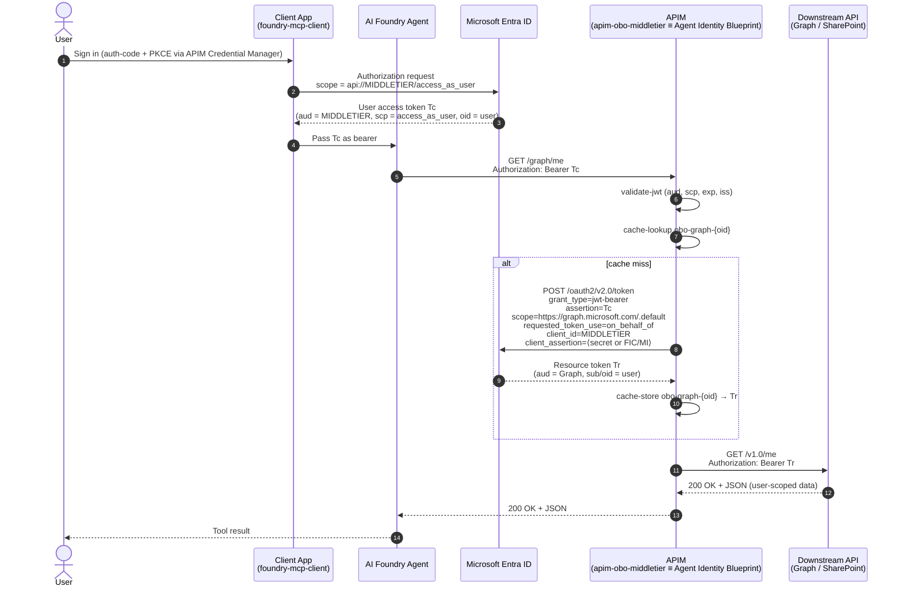

# OBO Flows: AI Foundry → APIM → Downstream API

This repo documents **On-Behalf-Of (OBO)** auth patterns for letting an
AI Foundry agent call user-protected APIs through Azure API Management. APIM
is the middle tier that performs the OBO token exchange (Option A in our
design choices).

## Documents

| Scenario | File |
|---|---|
| OBO to **SharePoint REST** | [`obo-foundry-apim-sharepoint.md`](./obo-foundry-apim-sharepoint.md) |
| OBO to **Microsoft Graph** | [`obo-foundry-apim-graph.md`](./obo-foundry-apim-graph.md) |

---

## The Common Pattern

Both scenarios use the **identical** OBO shape:

```
User → AI Foundry Agent → APIM (validate JWT + OBO exchange) → Downstream API
```

What's the same in both:

- **One APIM app registration** (`apim-obo-middletier`) acts as:
  - The audience for the user's token (`api://<APIM_OBO_MIDDLETIER_CLIENT_ID>/access_as_user`)
  - The identity that performs the OBO exchange (using its client secret)
- **AI Foundry** acquires the user token using the APIM app's scope and
  attaches it as `Authorization: Bearer <user-token>` when calling APIM.
- **APIM policy** does:
  1. `validate-jwt` against the user token
  2. Cache lookup for an OBO token keyed on the user's `oid`
  3. On miss, `send-request` to AAD's `/oauth2/v2.0/token` with
     `grant_type=urn:ietf:params:oauth:grant-type:jwt-bearer` and
     `requested_token_use=on_behalf_of`
  4. Cache the result
  5. Replace the `Authorization` header with the new token
  6. `set-backend-service` to the downstream API

---

## What Changes Between Scenarios

| Concern | SharePoint REST | Microsoft Graph |
|---|---|---|
| **OBO `scope` parameter** | `https://<tenant>.sharepoint.com/.default` | `https://graph.microsoft.com/.default` |
| **Backend base URL** | `https://<tenant>.sharepoint.com/_api/v1.0` | `https://graph.microsoft.com/v1.0` |
| **Delegated permission on APIM app** | SharePoint → `Sites.Read.All` (or `AllSites.Read`) | Microsoft Graph → `Sites.Read.All`, `Files.Read.All`, `User.Read`, etc. |
| **Cache key prefix (recommended)** | `obo-sp-<oid>` | `obo-graph-<oid>` |
| **Endpoint shape** | SharePoint REST URI conventions | Graph path-based REST |
| **Throttling profile** | Standard SP REST throttling | Aggressive; honor `Retry-After` |
| **Conditional Access exposure** | Lower (SP REST often less restricted) | Higher (Graph commonly under MFA / compliant device CA) |
| **Permission granularity** | Fewer, broader scopes | Many fine-grained scopes |

---

## What Stays the Same

- App registration design (single middle-tier app, optional separate client
  app with `knownClientApplications`)
- `validate-jwt` accepts both audience forms — the bare client-id GUID
  (v2 tokens) and `api://<APIM_OBO_MIDDLETIER_CLIENT_ID>` (v1 tokens)
- Required `scp` claim = `access_as_user`
- AAD token endpoint + OBO request shape
- Per-user caching strategy and TTL (~50 min, under the typical 60-min token
  lifetime)
- `accessTokenAcceptedVersion: 2` in the APIM app manifest
- Storing the APIM client secret in a **Key Vault-backed named value**
- AI Foundry agent configuration (the user token works for *both* APIs because
  the OBO exchange happens server-side with a different `scope` each time)

---

## Can One APIM App Serve Both?

Yes — and it's the recommended approach. On `apim-obo-middletier`:

- Add **SharePoint** delegated permission (e.g., `Sites.Read.All`)
- Add **Microsoft Graph** delegated permissions (e.g., `Sites.Read.All`,
  `Files.Read.All`, `User.Read`)
- **Grant admin consent** for both

Then create two APIM APIs (`/sharepoint` and `/graph`) with policies that
differ only in:

- The OBO `scope` parameter
- The cache key prefix
- The backend base URL

---

## Cross-Cutting Pitfalls

| Pitfall | Applies to | Fix |
|---|---|---|
| User token audience targets the downstream API directly | Both | Token must be issued for `api://<APIM_OBO_MIDDLETIER_CLIENT_ID>` |
| OBO scope missing `.default` | Both | Use `<resource>/.default` for v2 endpoint |
| No admin consent on the downstream permission | Both | Grant admin consent on APIM app |
| Cache key collisions across downstream APIs | Both | Use distinct prefixes per downstream resource |
| `accessTokenAcceptedVersion = 1` | Both | Set to `2` in the app manifest |
| Conditional Access blocking OBO | Mostly Graph | User's original sign-in must satisfy CA |
| Ignoring downstream throttling | Mostly Graph | Honor `Retry-After`; back off |

---

## Decision Quick-Reference

- Need to read a SharePoint **site/list/library** with the SP REST surface?
  → SharePoint REST flow
- Need cross-Microsoft-365 data (Files, Mail, Calendar, Teams, Users)?
  → Graph flow
- Need both? → One APIM app, two APIM APIs, two policies (same shape)

---

## Background: Microsoft Entra Agent ID OAuth

Microsoft has published guidance for how **agents** (AI agents acting on
behalf of users) should obtain tokens. Two key references:

| Reference | What it covers |
|---|---|
| [Authentication protocols in agents](https://learn.microsoft.com/en-us/entra/agent-id/agent-oauth-protocols) | Overview of the three OAuth flows agents support: on-behalf-of, autonomous, and "agent's user account" |
| [Agent OAuth flows: On behalf of flow](https://learn.microsoft.com/en-us/entra/agent-id/agent-on-behalf-of-oauth-flow) | Step-by-step OBO flow specifically for agents, including the federated identity credential / managed identity pattern |

### How this maps to what's in this repo

The Microsoft "Agent OBO" pattern introduces two related identities:

| Microsoft term | What it is | Mapping in this repo |
|---|---|---|
| **Agent identity blueprint** | The "parent" confidential client app representing the agent product/service. Holds delegated permissions and (preferably) a **managed identity / FIC** as its credential. Equivalent to a classic OBO **middle-tier API** app. | `apim-obo-middletier` (the app APIM uses to perform the OBO exchange) |
| **Agent identity** | A child identity that performs the actual OBO token exchange on behalf of a specific agent instance. Authenticates to Entra by presenting a token (`T1`) issued to its parent blueprint, plus the user's token (`Tc`). | Not modeled separately today — APIM acts as both the audience for `Tc` *and* the principal performing the OBO exchange, using the middle-tier's secret. |
| **Client app** (the calling agent) | The OAuth client that signs the user in and obtains `Tc`. | `foundry-mcp-client` (the app reg Foundry's MCP credential provider uses) |

### Key rules from the Microsoft references

- **No `/authorize` for agents.** Agents are confidential clients that
  exchange tokens programmatically. They do not run interactive auth-code
  flows themselves — a separate **client app** (e.g. `foundry-mcp-client`)
  handles user sign-in and produces the user token (`Tc`).
- **Supported grant types:** `client_credentials`, `jwt-bearer` (used for
  OBO), and `refresh_token` (for background continuation of user-context
  work).
- **Audience rules for OBO:** the user token (`Tc`) must have
  `aud = AgentIdentityBlueprint client ID`. In our setup, that is
  `aud = apim-obo-middletier client ID` — which is exactly what the APIM
  `validate-jwt` policy enforces.
- **Don't use client secrets in production.** Microsoft strongly recommends
  **federated identity credentials (FIC) backed by a managed identity**, or
  client certificates, instead of a client secret on the middle-tier /
  blueprint app. The current docs show `client_secret` for simplicity; for
  production, swap APIM's named-value secret for a FIC + UAMI configuration
  (a future enhancement to this repo).

### Auth flow (mermaid)

This is the end-to-end shape used in this repo, expressed in Microsoft's
agent-OBO terminology:



#### How the diagram lines up with the Microsoft "Agent OBO" steps

| Microsoft step | This repo |
|---|---|
| (1) User authenticates with the client → `Tc` | `User → Client App → Entra` (steps 1–3 in the diagram) |
| (2) Client sends `Tc` to the agent identity blueprint | `Client → Foundry → APIM` (steps 4–5) |
| (3) Blueprint requests `T1` using its credential (secret today; FIC/MI recommended) | Embedded inside step 8: APIM's `client_id` + `client_assertion` to AAD |
| (4) Agent identity sends OBO request with `T1` + `Tc` | Step 8 — single `send-request` from APIM combines both roles |
| (5) AAD returns the resource token after validating audiences | Step 9 — `Tr` returned to APIM |

> APIM currently fuses "blueprint" and "agent identity" into one principal
> (the `apim-obo-middletier` app), which is fine for in-tenant deployments.
> Splitting them only matters when you need per-instance agent identities or
> when adopting full Agent ID with FIC + managed identity.

