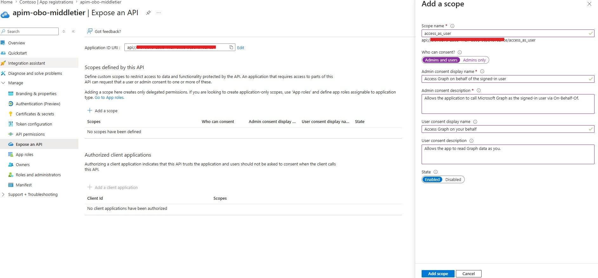
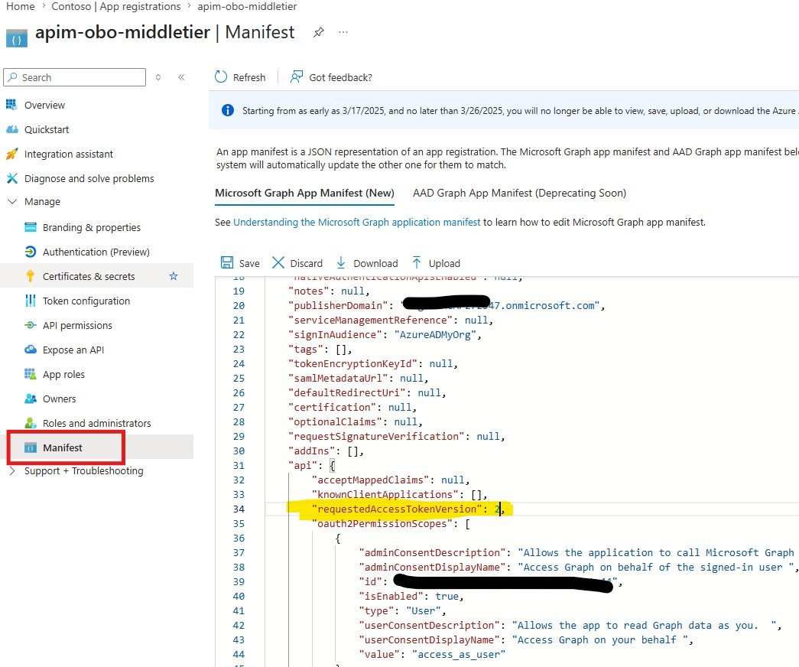
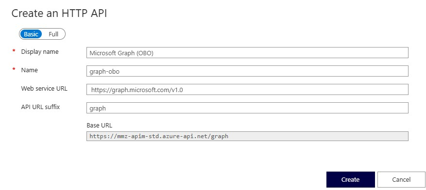
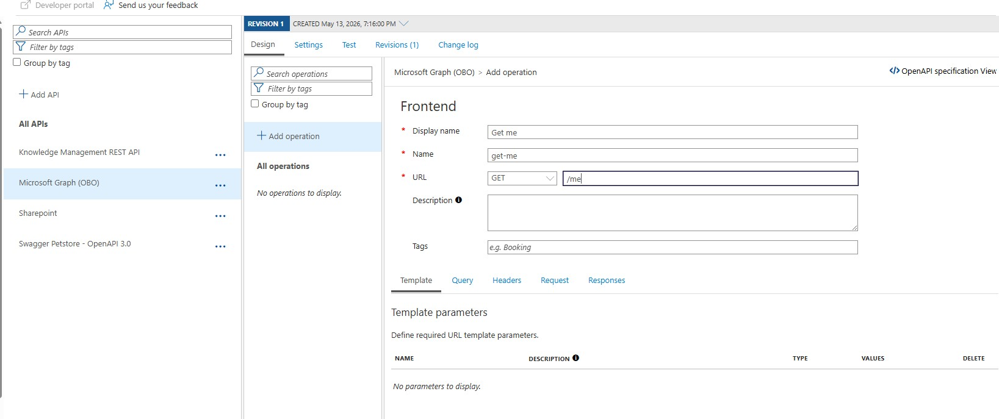
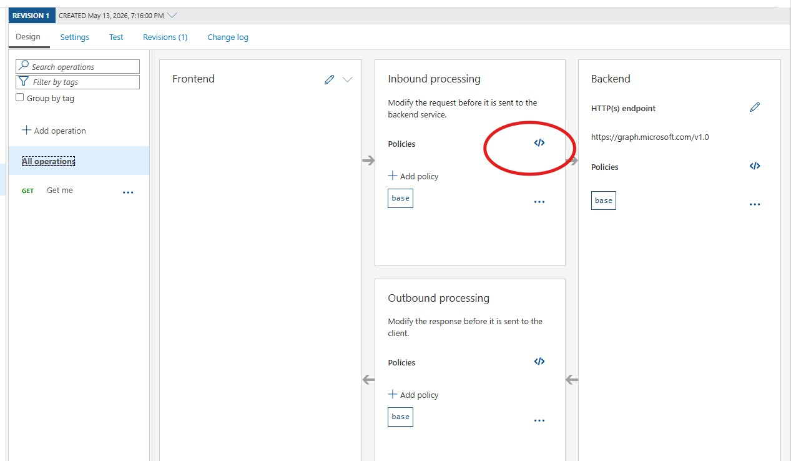
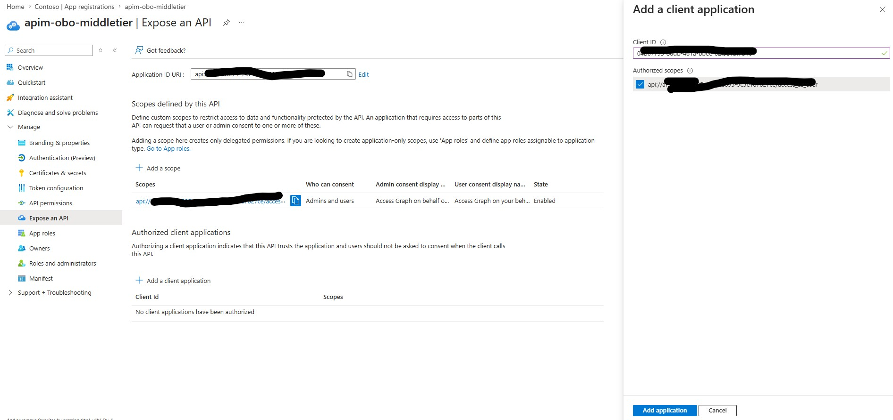

# OBO Flow: AI Foundry → APIM → Microsoft Graph

This document describes how to set up an **On-Behalf-Of (OBO)** flow where an
AI Foundry agent calls a Microsoft Graph endpoint through APIM on behalf of a
signed-in user. APIM is the middle tier that performs the OBO token exchange
(Option A).

**Example endpoint (Graph equivalent of the SharePoint site lookup):**
```
GET https://mmz-apim-std.azure-api.net/graph/sites/mngenvmcap272547.sharepoint.com:/sites/dataforfishing
```

---

## Why OBO?

```
User → AI Foundry Agent → APIM → Microsoft Graph
```

Graph must enforce permissions based on **the user**, not the agent. OBO lets
APIM exchange the user's token (audience = APIM) for a new token with
audience = Graph, while preserving the user's identity (`sub`/`oid`).

---

## Token Flow Overview

```
1. User signs in → token with scope: api://<APIM_OBO_MIDDLETIER_CLIENT_ID>/access_as_user
                   (audience = APIM's app registration)

2. AI Foundry agent calls APIM with that user token in
   Authorization: Bearer <token>

3. APIM validates the token (validate-jwt policy)

4. APIM performs OBO exchange against AAD:
      POST https://login.microsoftonline.com/<tenant>/oauth2/v2.0/token
      grant_type            = urn:ietf:params:oauth:grant-type:jwt-bearer
      client_id             = <APIM_OBO_MIDDLETIER_CLIENT_ID>
      client_secret         = <APIM_OBO_MIDDLETIER_CLIENT_SECRET>
      assertion             = <user's token>
      scope                 = https://graph.microsoft.com/.default
      requested_token_use   = on_behalf_of

5. AAD returns a NEW token (audience = Graph, sub = the user)

6. APIM forwards request to https://graph.microsoft.com with the new token
```

---

## Step 1 — Create (or Reuse) the APIM Middle-Tier App Registration

You can **reuse the same `apim-obo-middletier` app registration** used for the
SharePoint flow. Just add the Graph permissions to it.

In **Entra ID → App registrations → `apim-obo-middletier`**:

1. **API permissions** → Add a permission → **Microsoft Graph** → **Delegated permissions**.
   Pick the *minimum* permissions you actually need. Common choices:

   | Permission | Admin consent required? | When to use |
   |---|---|---|
   | `User.Read` | No | Sign in + read the signed-in user's own profile |
   | `Sites.Read.All` | **Yes** | Read items in all SharePoint sites the user can access |
   | `Files.Read.All` | **Yes** | Read all files the user can access (OneDrive + SP) |
   | `Mail.Read` | **Yes** | Read the user's mail |
   | `Calendars.Read` | **Yes** | Read the user's calendar |

   Click **Grant admin consent for `<tenant>`** at the top of the permissions list.

   ### About admin consent

   The Azure portal labels each permission with **Admin consent required: Yes/No**.

   - **No** (e.g., `User.Read`): each user *can* consent for themselves on first
     sign-in. They'll see a prompt like *"App needs permission to sign you in
     and read your profile."*
   - **Yes** (anything ending in `.All`, or anything that reads/writes data
     across users / the tenant): **only an admin can consent**. Users cannot
     self-consent.

   **Even when admin consent isn't required, you should still grant it for the AI Foundry scenario:**

   | Without admin consent | With admin consent |
   |---|---|
   | Each user sees a consent prompt on first use | Silent for all users |
   | AI Foundry / non-interactive flows may not surface the prompt cleanly | Just works |
   | OBO can fail with `consent_required` if the user hasn't consented yet | OBO works immediately |
   | Per-user consent — must be revoked per-user | Tenant-wide, centrally managed |

   Clicking **Grant admin consent for `<tenant>`** consents to *all* permissions
   on the app at once — both the optional (`User.Read`) and the required
   (`.All`) ones. One button covers everything.
2. Confirm the app still has:
   - **Expose an API** → scope `access_as_user` (audience for the user token).
     If you haven't created it yet, click **Expose an API → + Add a scope** and
     fill in:
     - Application ID URI: `api://<APIM_OBO_MIDDLETIER_CLIENT_ID>` (accept the default GUID-based URI)
     - Scope name: `access_as_user`
     - Who can consent? **Admins and users**
     - Admin consent display name: `Access Microsoft Graph on behalf of the signed-in user`
     - Admin consent description: `Allows the application to call Microsoft Graph as the signed-in user via On-Behalf-Of.`
     - User consent display name: `Access Microsoft Graph on your behalf`
     - User consent description: `Allows the app to read Microsoft Graph data as you.`
     - State: **Enabled**

     

   - A valid **client secret** → `APIM_OBO_MIDDLETIER_CLIENT_SECRET`
   - `"accessTokenAcceptedVersion": 2` (or `"requestedAccessTokenVersion": 2`
     in the newer manifest schema) in the **Manifest** blade

     

> ⚠️ **`.default` returns all consented scopes.** The OBO token will carry
> every Graph delegated permission the user/admin has consented to for this
> app — not just one. That's expected behavior for v2 `.default` requests.

---

## Step 2 — AI Foundry Agent Config

No change from the SharePoint scenario. The user still signs in with scope:

```
api://<APIM_OBO_MIDDLETIER_CLIENT_ID>/access_as_user
```

The same user token works for both APIM APIs (SharePoint and Graph), because
the OBO exchange happens *server-side* with a different downstream `scope`
each time.

For the concrete wiring of an AI Foundry MCP tool that uses **OAuth Identity
Passthrough**, see
[Wiring up an AI Foundry MCP tool (OAuth Identity Passthrough)](#wiring-up-an-ai-foundry-mcp-tool-oauth-identity-passthrough)
at the end of this document.

---

## Step 3 — APIM Named Values

In the Azure portal: **APIM instance → APIs → Named values → + Add**.



Reuse the existing named values; add one for the Graph base URL if you like:

| Name | Value | Notes |
|---|---|---|
| `tenant-id` | your tenant GUID | Already exists |
| `apim-obo-middletier-client-id` | from app registration | Already exists |
| `apim-obo-middletier-client-secret` | from app registration | Key Vault-backed |
| `graph-base-url` | `https://graph.microsoft.com/v1.0` | New (optional) |

---

## Step 4 — Create the API and Add an Operation in APIM

### Create the API

**APIs → + Add API → HTTP** (manual entry).

| Field | Value |
|---|---|
| Display name | `Microsoft Graph (OBO)` |
| Name | `graph-obo` |
| Web service URL | `https://graph.microsoft.com/v1.0` |
| API URL suffix | `graph` |
| Products | (pick one, e.g., `Unlimited` for testing) |

Click **Create**.

### Add an Operation

On the new API → **+ Add operation**:

| Field | Value |
|---|---|
| Display name | `Get me` |
| Name | `get-me` |
| URL | `GET /me` |

Click **Save**.



---

## Step 5 — APIM Policy: Validate Inbound Token + Perform OBO for Graph

On the `Microsoft Graph (OBO)` API → **Design** tab → select **All operations**
(top of the operation list, so the policy applies to every operation). In the
**Inbound processing** box, click the **`</>`** icon to open the policy code
editor.



Replace the contents with the policy below. The only differences vs. the
SharePoint policy are the **OBO scope** and the **backend base URL**.

```xml
<policies>
    <inbound>
        <base />

        <!-- 1. Validate inbound user token -->
        <validate-jwt header-name="Authorization" failed-validation-httpcode="401" require-scheme="Bearer">
            <openid-config url="https://login.microsoftonline.com/{{tenant-id}}/v2.0/.well-known/openid-configuration" />
            <audiences>
                <!-- v2 tokens (accessTokenAcceptedVersion = 2): aud is the bare client-id GUID -->
                <audience>{{apim-obo-middletier-client-id}}</audience>
                <!-- v1 tokens: aud is the Application ID URI -->
                <audience>api://{{apim-obo-middletier-client-id}}</audience>
            </audiences>
            <required-claims>
                <claim name="scp" match="any">
                    <value>access_as_user</value>
                </claim>
            </required-claims>
        </validate-jwt>

        <!-- 2. Extract user token + user object id (cache key) -->
        <set-variable name="userToken" value="@(context.Request.Headers.GetValueOrDefault("Authorization","").Replace("Bearer ", ""))" />
        <set-variable name="userOid" value="@{
            var jwt = ((string)context.Variables["userToken"]).AsJwt();
            return jwt.Claims.GetValueOrDefault("oid", "");
        }" />

        <!-- 3. Try cache (note: Graph-specific cache key) -->
        <cache-lookup-value key="@("obo-graph-" + (string)context.Variables["userOid"])" variable-name="graphToken" />

        <!-- 4. On miss, perform OBO exchange for Graph -->
        <choose>
            <when condition="@(!context.Variables.ContainsKey("graphToken"))">
                <send-request mode="new" response-variable-name="oboResponse" timeout="20" ignore-error="false">
                    <set-url>https://login.microsoftonline.com/{{tenant-id}}/oauth2/v2.0/token</set-url>
                    <set-method>POST</set-method>
                    <set-header name="Content-Type" exists-action="override">
                        <value>application/x-www-form-urlencoded</value>
                    </set-header>
                    <set-body>@{
                        return
                            "grant_type=urn:ietf:params:oauth:grant-type:jwt-bearer" +
                            "&client_id={{apim-obo-middletier-client-id}}" +
                            "&client_secret={{apim-obo-middletier-client-secret}}" +
                            "&assertion=" + System.Net.WebUtility.UrlEncode((string)context.Variables["userToken"]) +
                            "&scope=" + System.Net.WebUtility.UrlEncode("https://graph.microsoft.com/.default") +
                            "&requested_token_use=on_behalf_of";
                    }</set-body>
                </send-request>

                <set-variable name="graphToken" value="@{
                    var body = ((IResponse)context.Variables["oboResponse"]).Body.As<JObject>();
                    return (string)body["access_token"];
                }" />

                <cache-store-value
                    key="@("obo-graph-" + (string)context.Variables["userOid"])"
                    value="@((string)context.Variables["graphToken"])"
                    duration="3000" />
                <!-- 50 minutes; under typical 60-min token TTL -->
            </when>
        </choose>

        <!-- 5. Replace Authorization with the Graph token -->
        <set-header name="Authorization" exists-action="override">
            <value>@("Bearer " + (string)context.Variables["graphToken"])</value>
        </set-header>

        <!-- 6. Point to Graph backend -->
        <set-backend-service base-url="{{graph-base-url}}" />
    </inbound>
    <backend>
        <base />
    </backend>
    <outbound>
        <base />

        <!-- Optional: respect Graph throttling -->
        <choose>
            <when condition="@(context.Response.StatusCode == 429)">
                <set-header name="X-Graph-Throttled" exists-action="override">
                    <value>true</value>
                </set-header>
            </when>
        </choose>
    </outbound>
    <on-error>
        <base />
    </on-error>
</policies>
```

> 🔑 Use a **Graph-specific cache key** (`obo-graph-<oid>`) so it doesn't
> collide with the SharePoint OBO token cached under `obo-sp-<oid>`.

> 🎫 **Why two audiences?** With `accessTokenAcceptedVersion = 2` in the app
> manifest, AAD issues v2 tokens whose `aud` claim is the **bare client-id
> GUID** (e.g. `af979b79-...`). Older v1 tokens use the Application ID URI
> form (`api://af979b79-...`). Listing both makes the policy work regardless
> of which token version a client requests, which avoids `Invalid JWT` errors
> when switching tools (Azure CLI, MSAL, AI Foundry).

---

## Step 6 — Test End-to-End

1. Get a user token for `api://<APIM_OBO_MIDDLETIER_CLIENT_ID>/access_as_user`
   (see [Testing with the Azure CLI](#testing-with-the-azure-cli) below).
2. Decode at <https://jwt.ms> — confirm `aud`, `scp`, and `oid`.
3. Call the APIM endpoint:
   ```http
   GET https://mmz-apim-std.azure-api.net/graph/me
   Authorization: Bearer <user-token>
   Ocp-Apim-Subscription-Key: <apim-subscription-key>
   ```
   > The path is `/graph/me`, not `/graph/v1.0/me`. The `v1.0` is already part
   > of the backend URL configured on the API (`https://graph.microsoft.com/v1.0`),
   > so APIM appends only what comes after the `/graph` suffix.

   > 🔑 The `Ocp-Apim-Subscription-Key` header is required if the API has
   > **Subscription required** enabled (the default). Get a key from
   > **APIM portal → Subscriptions → Show/hide keys**, or disable the
   > requirement — see [Disabling subscription requirement](#disabling-subscription-requirement-optional)
   > below.
4. APIM **Test console → Enable tracing** to inspect the OBO exchange and the
   downstream Graph call.

### Disabling subscription requirement (optional)

For early testing — when an AI Foundry agent will authenticate solely with the
user's bearer token and you don't want to also juggle a subscription key — you
can turn off the subscription gate on this API:

**APIM portal → APIs → `Microsoft Graph (OBO)` → Settings tab → uncheck
**Subscription required** → Save.**

| Subscription required | When to use |
|---|---|
| ✅ On | Production. Lets you meter, throttle, and revoke per-consumer. |
| ❌ Off | Dev/test, or when the bearer token *is* your auth/identity gate (e.g., the validate-jwt policy already proves it's a known user). |

Even with subscription off, the `validate-jwt` policy still rejects unauthenticated callers, so the API isn't open.

### Testing with the Azure CLI

For ad-hoc testing you don't need a separate test client app — you can have the
**Azure CLI** request a token for the middle-tier app. The Azure CLI has a
well-known public client ID (`04b07795-8ddb-461a-bbee-02f9e1bf7b46`) that
Microsoft publishes for exactly this purpose.

> 💡 The AI Foundry agent itself does **not** use this; it has its own client
> credentials. Pre-authorizing the Azure CLI only affects what *you* can do
> from your terminal — it adds no redirect URIs and does not enable public
> client flows on the middle-tier app.

**One-time setup** — on the `apim-obo-middletier` app registration:

**Expose an API → Authorized client applications → + Add a client application**

| Field | Value |
|---|---|
| Client ID | `04b07795-8ddb-461a-bbee-02f9e1bf7b46` (Microsoft Azure CLI) |
| Authorized scopes | ✅ `api://<APIM_OBO_MIDDLETIER_CLIENT_ID>/access_as_user` |

Click **Add application**.



**Get a token and call APIM:**

```powershell
az login --tenant <tenant-id>

$token = az account get-access-token `
  --resource "api://<APIM_OBO_MIDDLETIER_CLIENT_ID>" `
  --query accessToken -o tsv

# Subscription key from APIM portal → Subscriptions → Show/hide keys
$subKey = "<paste-primary-key>"

# Sanity check at https://jwt.ms — verify:
#   aud = api://<APIM_OBO_MIDDLETIER_CLIENT_ID>
#   scp contains access_as_user
#   oid = your user object id
$token

curl.exe -H "Authorization: Bearer $token" `
        -H "Ocp-Apim-Subscription-Key: $subKey" `
        "https://mmz-apim-std.azure-api.net/graph/me"
```

If you skip the authorized-client-application step, `az account get-access-token`
fails with `AADSTS65001` (the Azure CLI hasn't been consented to call your API).

---

## Graph-Specific Considerations

1. **Granular scopes** — Pick the minimum delegated permissions. `.default`
   will return tokens carrying *all* admin-consented Graph permissions on the
   APIM app.
2. **Conditional Access (CA)** — Graph is commonly behind CA (MFA, compliant
   device). OBO can fail with `AADSTS50076` / `interaction_required` if the
   user's original sign-in didn't satisfy CA. The middle tier **cannot**
   satisfy MFA — the user must.
3. **Throttling** — Graph throttles aggressively. Caching OBO tokens (already
   done) and honoring `Retry-After` on 429 responses is important.
4. **Permission scope vs. resource access** — Having `Sites.Read.All` does not
   override item-level SharePoint permissions; OBO preserves user identity, so
   the user still needs access to the specific resource.
5. **Beta endpoint** — If you need `/beta`, change `graph-base-url` accordingly,
   but be aware Microsoft considers beta non-production.

---

## Sanity Checklist

- [ ] APIM app has the required Graph delegated permissions, **admin-consented**
- [ ] User's token audience = APIM app's client ID / app URI
- [ ] User's token contains the required `scp` claim
- [ ] OBO scope = `https://graph.microsoft.com/.default`
- [ ] APIM client secret is in a **Key Vault-backed named value**
- [ ] OBO tokens are cached per-user with a **Graph-specific key**
- [ ] `accessTokenAcceptedVersion = 2` in the APIM app manifest
- [ ] User's original sign-in satisfies any Conditional Access on Graph

---

## Troubleshooting

A walk-through of the issues we actually hit while wiring this up, and how to
diagnose each one.

### Enabling secure tracing

The classic *Test console → Trace* button now requires the subscription to
have **Allow tracing** turned on, OR you must use a **time-limited debug
token** from the management API. Quickest path:

1. APIM portal → **Subscriptions** → pick the one the Test console is using
   (e.g. *Built-in all-access subscription*) → toggle **Allow tracing = Yes**
   → Save.
2. Back in **APIs → `Microsoft Graph (OBO)` → Test** tab → click the **Trace**
   button next to **Send** → click **Send**. The **`! Trace`** tab will now
   populate.

If your org disallows that toggle, use the management API flow:
`listDebugCredentials` → call APIM with `Apim-Debug-Authorization: <debug-token>`
→ note the `Apim-Trace-Id` response header → `listTrace` to fetch the JSON.

### `401 Invalid JWT` from APIM

`validate-jwt` rejected the inbound user token. Decode the token at
<https://jwt.ms> and check:

| Claim | Expected | Notes |
|---|---|---|
| `aud` | `<APIM_OBO_MIDDLETIER_CLIENT_ID>` (v2) **or** `api://<APIM_OBO_MIDDLETIER_CLIENT_ID>` (v1) | Policy lists both — see [v1 vs v2 audience](#v1-vs-v2-audience) |
| `iss` | `https://login.microsoftonline.com/<tenant-id>/v2.0` (v2) or `https://sts.windows.net/<tenant-id>/` (v1) | Must match the openid-config in the policy |
| `scp` | contains `access_as_user` | The required claim |
| `tid` | your tenant GUID | Must match `{{tenant-id}}` named value |
| `exp` | in the future | Get a fresh token if expired |

### v1 vs v2 audience

With `accessTokenAcceptedVersion = 2` in the manifest, AAD issues v2 tokens
where `aud` is the **bare client-id GUID** (not `api://<guid>`). The policy
lists both audiences so it accepts either. If you only list one and the
client requests the other, you get `401 Invalid JWT` even though the token
is otherwise valid.

### `500 Internal Server Error` after `validate-jwt` passes

Almost always the OBO exchange to AAD failed and the policy's
`Body.As<JObject>()` threw because the response wasn't `{access_token: ...}`.

**Option A — read the trace.** Find the `send-request` entry → its response
status + body. AAD returns a JSON `error` object with an `AADSTSxxxxx` code
that pinpoints the issue.

**Option B — surface the AAD error temporarily.** Patch the policy:

1. Set `ignore-error="true"` on the `<send-request>` so the next policy can
   inspect the failure.
2. Right after `</send-request>`, insert:

   ```xml
   <choose>
       <when condition="@(((IResponse)context.Variables["oboResponse"]).StatusCode != 200)">
           <return-response>
               <set-status code="500" reason="OBO exchange failed" />
               <set-header name="Content-Type" exists-action="override">
                   <value>application/json</value>
               </set-header>
               <set-body>@{
                   var r = (IResponse)context.Variables["oboResponse"];
                   return "{\"oboStatus\":" + r.StatusCode + ",\"oboBody\":" + r.Body.As<string>(preserveContent: true) + "}";
               }</set-body>
           </return-response>
       </when>
   </choose>
   ```

Now the response body contains AAD's exact error. **Revert both changes after
debugging** — leaving them in production leaks AAD error details.

### Common AAD error codes from the OBO exchange

| Code | Meaning | Fix |
|---|---|---|
| `AADSTS65001` | `consent_required` — user/admin hasn't consented to the requested scope | Entra → `apim-obo-middletier` → API permissions → **Grant admin consent for `<tenant>`** |
| `AADSTS7000215` | `invalid_client_secret` | Secret expired or wrong. Rotate it; update the APIM named value |
| `AADSTS500131` | Audience mismatch on the assertion | The user token wasn't issued for the middle-tier app — confirm scope `api://<MIDDLETIER>/access_as_user` |
| `AADSTS50013` | Assertion not within valid time range | Get a fresh token; check clock skew |
| `AADSTS50076` / `interaction_required` | Conditional Access requires MFA / compliant device | The user must satisfy CA at original sign-in; OBO can't satisfy it |
| `AADSTS70011 invalid_scope` | Wrong OBO scope | Must be `https://graph.microsoft.com/.default` for Graph |

### Protecting secrets in traces

By default a named value's value is rendered **in plaintext** inside trace
entries — including `set-body` evaluations that interpolate it. To keep client
secrets out of traces:

- Mark the named value as **Secret** (checkbox in **APIM → Named values → Edit**), or
- Back the named value with **Key Vault** (recommended).

Both make APIM redact the value in traces (you'll see `••••••••` instead).

If a secret has already appeared in a trace — or in any output you shared
externally — **rotate it** in Entra → app registration → Certificates &
secrets, then update the APIM named value.

### Subscription key vs bearer token

A 401 like `{ "statusCode": 401, "message": "Access denied due to missing
subscription key." }` is APIM's **product subscription gate**, not the JWT
policy. Either:

- Send `Ocp-Apim-Subscription-Key: <key>` (APIM → Subscriptions), **or**
- Disable subscription on the API — see
  [Disabling subscription requirement](#disabling-subscription-requirement-optional).

The bearer token alone is not enough when subscriptions are required.

### `404` / wrong path under `/graph`

API URL suffix is `graph`; backend is `https://graph.microsoft.com/v1.0`. APIM
appends only what comes after `/graph/` to that base.

```
GET https://mmz-apim-std.azure-api.net/graph/me        ✅
GET https://mmz-apim-std.azure-api.net/graph/v1.0/me   ❌  (becomes .../v1.0/v1.0/me)
```

---

## Common Pitfalls

| Pitfall | Symptom | Fix |
|---|---|---|
| Wrong audience on incoming token | `validate-jwt` returns 401 | Token must target APIM app, not Graph directly |
| Missing/incorrect Graph scope | AAD `invalid_scope` | Use `https://graph.microsoft.com/.default` |
| No admin consent on Graph permissions | AAD `consent_required` | Grant admin consent in the APIM app |
| Cache key collision with SharePoint flow | Wrong token sent downstream | Use distinct keys (`obo-graph-<oid>`, `obo-sp-<oid>`) |
| CA blocking OBO | `AADSTS50076` / `interaction_required` | User must satisfy CA at original sign-in |
| Throttling | `429 Too Many Requests` from Graph | Cache OBO tokens; honor `Retry-After`; back off |


---

## Wiring up an AI Foundry MCP tool (OAuth Identity Passthrough)

This section describes how to plug the OBO-protected APIM endpoint into an
**AI Foundry agent** as an MCP tool, using the **OAuth Identity Passthrough**
auth mode. With this mode, Foundry runs an OAuth 2.0 auth-code flow against
Entra to obtain a *user* token, then attaches it as `Authorization: Bearer`
to every MCP request. APIM''s `validate-jwt` policy validates that token,
performs the OBO exchange, and forwards to Graph as the user.

### Architecture

```
User ──> AI Foundry Agent ──(MCP + user bearer)──> APIM ──(OBO swap)──> Microsoft Graph
                  │
                  └── auth-code flow (PKCE) brokered by APIM Credential Manager
                      against Entra, using the foundry-mcp-client app reg
```

### App registrations involved

You should now have **three** app registrations:

| App registration | Role | Holds secret? |
|---|---|---|
| `apim-obo-middletier` | The OBO middle tier. Holds Graph delegated permissions. APIM uses its client secret to perform the OBO exchange. | ✅ Yes (used by APIM) |
| `foundry-mcp-client` | The OAuth client Foundry uses to sign users in. Has delegated permission to call `apim-obo-middletier/access_as_user`. | ✅ Yes (given to Foundry) |
| *(optional)* test client / Azure CLI pre-auth | For ad-hoc local testing | No |

### Step F1 — Create the `foundry-mcp-client` app registration

In **Entra ID → App registrations → + New registration**:

- Name: `foundry-mcp-client`
- Supported account types: single tenant
- Redirect URI: leave blank for now — you''ll add the APIM Credential Manager
  URL once Foundry generates it.

After creation:

1. **Certificates & secrets → + New client secret** → copy the *value* (you''ll
   paste it into Foundry).
2. **API permissions → + Add a permission → My APIs → `apim-obo-middletier`
   → Delegated → ✅ `access_as_user` → Add permissions**.
3. Click **Grant admin consent for `<tenant>`**.

   > Even though `access_as_user` shows "Admin consent required: No",
   > granting it once at the tenant level avoids per-user consent prompts
   > inside the agent UI (APIM Credential Manager doesn''t always surface
   > them cleanly).

4. *(Optional but recommended)* On `apim-obo-middletier` →
   **Expose an API → Authorized client applications → + Add**:
   - Client ID: `<foundry-mcp-client app id>`
   - ✅ `access_as_user`

   This pre-authorizes the Foundry client so users skip the consent dialog
   entirely.

### Step F2 — Add the MCP tool in Foundry

In your AI Foundry project: **Agent → Tools → + Add → Model Context Protocol**.

Fill in the dialog:

| Field | Value |
|---|---|
| **Name** | `apim-get-user-details` (or whatever describes the tool) |
| **Remote MCP Server endpoint** | Your APIM MCP endpoint, e.g. `https://mmz-apim-std.azure-api.net/graph` |
| **Authentication** | **OAuth Identity Passthrough** |
| **Client ID** | `<foundry-mcp-client app''s Application (client) ID>` |
| **Client secret** | the secret value from Step F1 |
| **Auth URL** | `https://login.microsoftonline.com/<tenant-id>/oauth2/v2.0/authorize` |
| **Token URL** | `https://login.microsoftonline.com/<tenant-id>/oauth2/v2.0/token` |
| **Refresh URL** | `https://login.microsoftonline.com/<tenant-id>/oauth2/v2.0/token` (same as Token URL for v2) |
| **Scopes** | `api://<APIM_OBO_MIDDLETIER_CLIENT_ID>/access_as_user offline_access openid profile` |

> 🔑 The `offline_access` scope is what makes Entra issue a refresh token,
> so Foundry can use the Refresh URL.

Click **Connect**.

### Step F3 — Add the APIM Credential Manager redirect URI

After clicking Connect, Foundry shows a dialog like *"You''ve created a
credential provider"* with a redirect URL such as:

```
https://global.consent.azure-apim.net/redirect/<guid>-<connection-name>
```

Copy that URL, then in Entra:

1. **App registrations → `foundry-mcp-client` → Authentication**
2. Under **Web platform** (add a Web platform if missing) → **+ Add URI** →
   paste the URL.
3. Leave **Implicit grant and hybrid flows** checkboxes **unchecked** —
   auth-code with PKCE doesn''t need them.
4. **Save**.

Back in Foundry, finish the connection. You''ll be redirected through Entra
sign-in once; on success the connection should show ✅.

### Step F4 — Sanity test

In the Foundry agent playground, invoke the tool. Expected behavior:

1. First call → Foundry pops a sign-in window (only on first use per user).
2. After sign-in, the agent calls APIM with `Authorization: Bearer <user-token>`.
3. APIM validates, performs OBO, calls Graph as the user, returns the result.

If something fails, see the [Troubleshooting](#troubleshooting) section above —
most common failures are missing admin consent, missing redirect URI, or
the APIM API still requiring a subscription key (Foundry won''t send one).

### Foundry-specific gotchas

| Symptom | Likely cause | Fix |
|---|---|---|
| Sign-in popup loops or fails with `redirect_uri_mismatch` | Credential Manager redirect URI not added to `foundry-mcp-client` | Add it under Authentication → Web platform |
| `consent_required` on first sign-in | Admin consent not granted on `foundry-mcp-client` for `access_as_user` | Click **Grant admin consent** on that app reg |
| MCP call returns `401` from APIM | Token audience wrong, or APIM still requires subscription key (Foundry doesn''t send `Ocp-Apim-Subscription-Key`) | Verify Scopes string includes the full `api://<MIDDLETIER>/access_as_user`; disable subscription on the API or inject the key in policy |
| MCP call returns `500` | OBO exchange failed downstream (e.g. missing Graph admin consent on `apim-obo-middletier`) | See [Troubleshooting → 500 after validate-jwt passes](#500-internal-server-error-after-validate-jwt-passes) |
| Refresh token never issued | `offline_access` not in Scopes | Add `offline_access` to the Scopes field |
